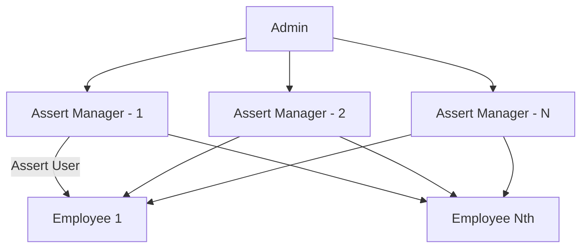

# Assert-Mangement
# Set-Up
  After installing the source adding to localhost hosted folder open path via CLI and run composer to install Dependencies.
  ```cli 
  composer update
  ```
### App
  - Rename the env to .env and save in Root Sourcecode.
  - Edit .env file with following configs 
    - app.baseURL = [ Your folder path example : http://localhost/Assert-Mangement ]
    - database.default.hostname = localhost
    - database.default.database = inventory
    - database.default.username = root
    - database.default.password = [Your password]
### Database
  To set database open phpmyadmin create a database `inventory`.
  
  After creating the database import `inventory.sql` file from root sourcecode.
### Chat Server
  `Enable php as global env`
  
  To Run Chat server open command line
  
  ```cli
  php index.php chatserver
  ```
  
  ## User roles
  

---
## Quick Guide
### Admin previlage
- Admin has ablity to create a assert item and added to inventory.
- Admin can able to assign the asset to assert-manager either single or multiple items.
### Assert-Manager
- Assigned Items are allocated to assert manager and can able to handle raised tickets on it's.
- Assert-Manager can able to distribute the assigned items to employee.
- can able to handle the damages, upgrades, repairs on assert items.
### Employee
- Assert items are assigned to employee can able to listed for records.
- Can able to report or raised a ticket on giving assert items.

---
## Features
- Employee can able to raise a ticket on his assigned item. Raised ticket is assigned to Assert manager
- All members has enabled chat


    
